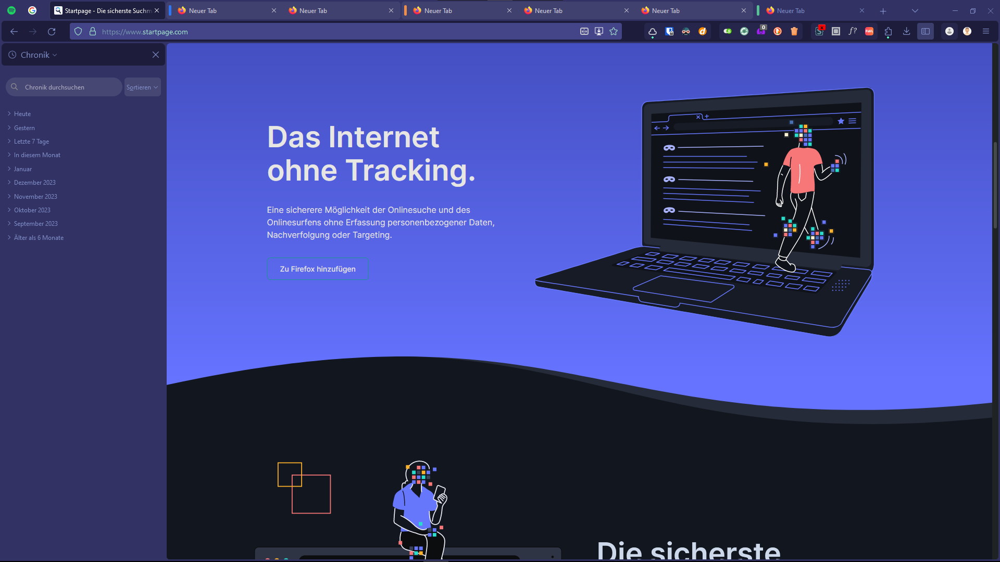

# ON(E) FIRE - Theme and userChrome styles for Firefox
*theme in screenshots: https://addons.mozilla.org/de/firefox/addon/vx-dark-neon/*

## Build
### Commands
#### Test
`sass userChrome/src/withDefaultColorsAndTabIslands.scss:userChrome/dist/withDefaultColorsAndTabIslands/userChrome.css userChrome/src/withDefaultColorsWithoutTabIslands.scss:userChrome/dist/withDefaultColorsWithoutTabIslands/userChrome.css userChrome/src/withoutDefaultColorsAndTabIslands.scss:userChrome/dist/withoutDefaultColorsAndTabIslands/userChrome.css userChrome/src/withoutDefaultColorsWithTabIslands.scss:userChrome/dist/withoutDefaultColorsWithTabIslands/userChrome.css`

#### about:config
##### activate multi account containers
- privacy.userContext.enabled" = true
- privacy.userContext.ui.enabled" = true
- privacy.userContext.longPressBehavior" = 2